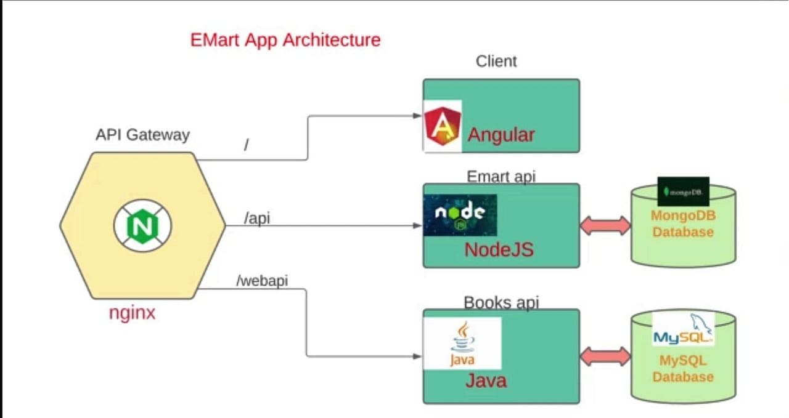

## CONTAINERIZING E-COMMERCE APPLICATION - NODEJS, ANGULAR, JAVA AND NGINX (MICROSERVICES)

__ARCHITECTURAL DESIGN__

__OVERVIEW__

We access the E-commerce Application through the __Nginx (API Gateway)__ which listens for requests and routes to the __Client microservice (Angular)__ using the URL which loads the frontend pages of the website. The Client connects to the backend services which is the __Emart api__ and __Books api__. __E-mart api (NodeJS)__ on __/api__ which uses a NoSQL database service - mongoDB and the __Books api (Java)__ which uses a MySQL database and is accessed on __/webapi__.

The Four microservices to be containerized include:

__Node.js microservice:__ A backend service built with Node.js and Express.

__Angular microservice:__ A frontend application built with Angular.

__Java microservice:__ A backend service built with Java and Spring Boot.

__Nginx:__ A web server used for routing and load balancing.

Clone the [E-martApp repository](https://github.com/dybran/Containerizing-Microservices-Project/tree/main/E-martApp-Project).

`$ git clone https://github.com/dybran/Containerizing-Microservices-Project.git`

`$ cd E-martApp-Project`

This is a Mono Repository which means that all the micro services source code is in one repository. Based on requirement, the micro services source codes are to be in different repository which is beneficial to create seperate CI/CD pipelines for the microservices. 