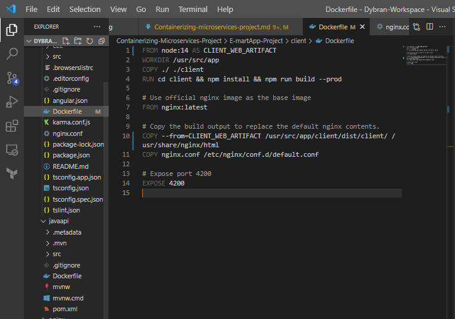
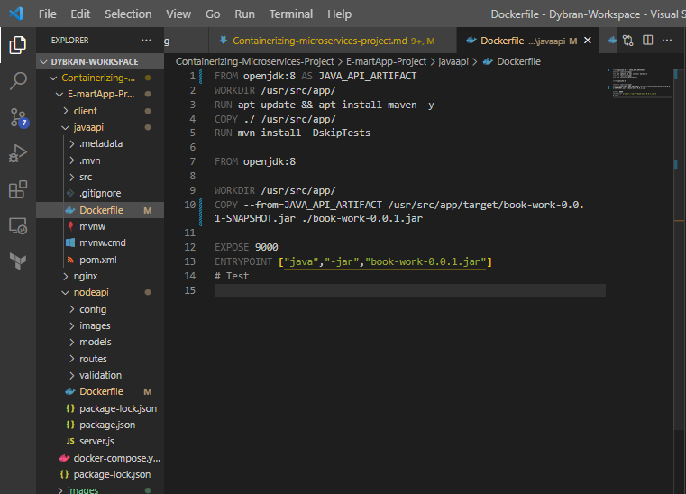
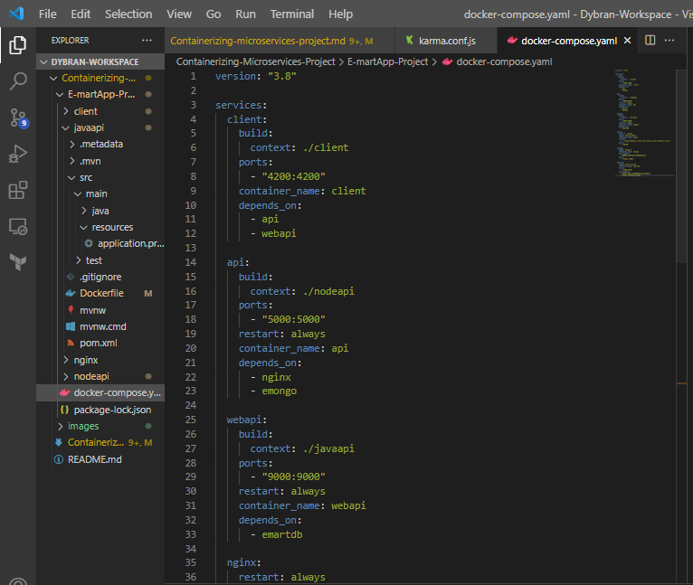
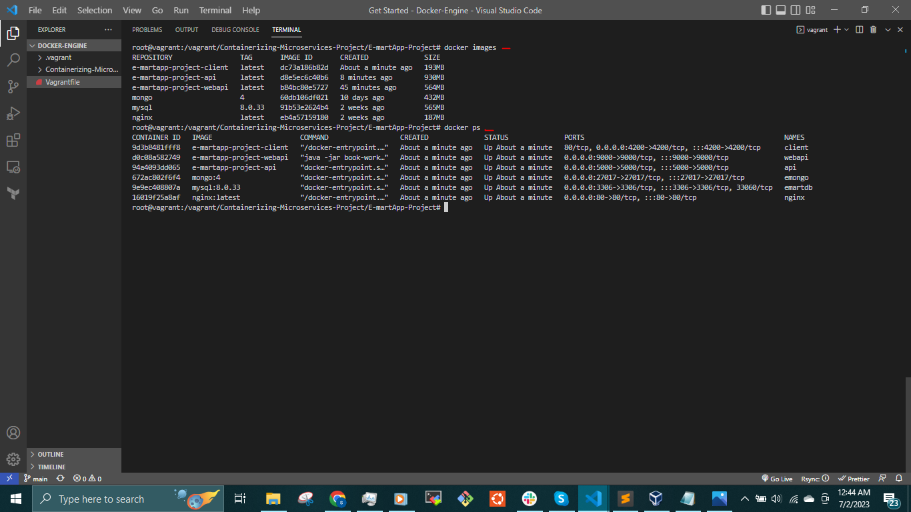

## CONTAINERIZING E-COMMERCE APPLICATION - NODEJS, ANGULAR, JAVA AND NGINX (MICROSERVICES)


Microservices is a software architectural style that structures an application as a collection of small, loosely coupled, and independently deployable services. Each microservice represents a specific business capability and can be developed, deployed, and scaled independently of other services.

In a microservices architecture, the application is broken down into a set of smaller, self-contained services that communicate with each other through well-defined APIs (Application Programming Interfaces). These services can be developed using different technologies, programming languages, and frameworks, as long as they can communicate with each other effectively.

However, adopting a microservices architecture also introduces challenges, such as managing distributed systems, ensuring consistent communication, dealing with data consistency across services, and monitoring the interactions between services.

Overall, microservices provide a modular and scalable approach to building complex applications by breaking them down into smaller, more manageable components that can be developed and deployed independently.

This Project is about containerizing an __E-Commerce Application__. This Application is made up of Microservices that are loosely coupled together.

__ARCHITECTURAL DESIGN__


__OVERVIEW__

We access the E-commerce Application through the __Nginx (API Gateway)__ which listens for requests and routes to the __Client microservice (Angular)__ using the URL which loads the frontend pages of the website. The client api uses an nginx configuration to route request to the backend services which is the __Emart api__ and __Books api__. __E-mart api (NodeJS)__ on __/api__ which uses a NoSQL database service - mongoDB and the __Books api (Java)__ which uses a MySQL database and is accessed on __/webapi__.

The Four microservices to be containerized include:

__Node.js microservice:__ A backend service built with Node.js and Express.

__Angular microservice:__ A frontend application built with Angular.

__Java microservice:__ A backend service built with Java and Spring Boot.

__Nginx:__ A web server used for routing and load balancing.

Create a folder

`$ mkdir Docker-Engine`

`$ cd Docker-Engine`

Pick an ubuntu box from the Vagrant cloud and run

`$ vagrant init <vagrant-box>`

Open the Vagrantfile and assign a unique IP address and increase the RAM size for the setup to run faster.

Then run `$ vagrant up` to bring up the VM

Clone the repository `$ git clone https://github.com/dybran/Containerizing-Microservices-Project.git`

`$ cd Containerizing-Microservices-Project/E-martApp-Project`


Install Docker Engine using the [Documentation](https://docs.docker.com/engine/install/ubuntu/).

Then `$ vagrant ssh` to login

Add the vagrant user to the docker group

`$ usermod -aG docker vagrant`

Log out and login then run

`$ id vagrant`

__N/B:__ Make sure it is in the same folder as the vagrantfile.


This is a Mono Repository which means that all the micro services source code is in one repository. Based on requirement, the micro services source codes are to be in different repository which is beneficial to create seperate CI/CD pipelines for the microservices. 

__Write the Dockerfiles__

__For Client__

```
FROM node:14 AS CLIENT_WEB_ARTIFACT
WORKDIR /usr/src/app
COPY ./ ./client
RUN cd client && npm install && npm run build --prod

# Use official nginx image as the base image
FROM nginx:latest

# Copy the build output to replace the default nginx contents.
COPY --from=CLIENT_WEB_ARTIFACT /usr/src/app/client/dist/client/ /usr/share/nginx/html
COPY nginx.conf /etc/nginx/conf.d/default.conf

# Expose port 4200
EXPOSE 4200
```



This is a multistage Dockerfile which builds the artifact and copies the artifact and the __ngnix.conf__ file to the desired location.

__N/B:__
Multistage Dockerfile is used so that the dependencies downloaded during the build process is not copied to the desired location. The dependencies increases the size of the image.

__For Java api - Emart api__

```
FROM openjdk:8 AS JAVA_API_ARTIFACT
WORKDIR /usr/src/app/
RUN apt update && apt install maven -y
COPY ./ /usr/src/app/
RUN mvn install -DskipTests

FROM openjdk:8

WORKDIR /usr/src/app/
COPY --from=JAVA_API_ARTIFACT /usr/src/app/target/book-work-0.0.1-SNAPSHOT.jar ./book-work-0.0.1.jar

EXPOSE 9000
ENTRYPOINT ["java","-jar","book-work-0.0.1.jar"]
# Test
```


This multistage Dockerfile builds the artifact and copies the artifact to the desired location.

__For nodeapi - Books api__

```
FROM node:14 AS NODE_API_ARTIFACT
WORKDIR /usr/src/app
COPY ./ ./nodeapi/
RUN cd nodeapi && npm install

FROM node:14
WORKDIR /usr/src/app/
COPY --from=NODE_API_ARTIFACT /usr/src/app/nodeapi/ ./
RUN ls
EXPOSE 5000
CMD ["/bin/sh", "-c", "cd /usr/src/app/ && npm start"]
# Test3
```


__For nginx__

We only need the configuration file - __default.conf__ to be attached to an nginx container which will be declared in the __docker-compose.yml__ file.

The __default.conf__ file

```
#upstream api {
#    server api:5000; 
#}
#upstream webapi {
#    server webapi:9000;
#}
upstream client {
    server client:4200;
}
server {
    listen 80;
    location / {
        proxy_set_header Host $host;
        proxy_set_header X-Real-IP $remote_addr;
        proxy_set_header X-Forwarded-For $proxy_add_x_forwarded_for;
        proxy_set_header X-Forwarded-Proto $scheme; 

        proxy_http_version 1.1;
        proxy_set_header Upgrade $http_upgrade;
        proxy_set_header Connection "upgrade";
        proxy_pass http://client/;
    }
    location /api {
#        rewrite ^/api/(.*) /$1 break; # works for both /api and /api/
#        proxy_set_header Host $host;
#        proxy_set_header X-Real-IP $remote_addr;
#        proxy_set_header X-Forwarded-For $proxy_add_x_forwarded_for;
#        proxy_set_header X-Forwarded-Proto $scheme; 
#        proxy_http_version 1.1;

        proxy_pass http://api:5000;
    }
    location /webapi {
#        rewrite ^/webapi/(.*) /$1 break;
#        proxy_set_header Host $host;
#        proxy_set_header X-Real-IP $remote_addr;
##        proxy_set_header X-Forwarded-For $proxy_add_x_forwarded_for;
#        proxy_set_header X-Forwarded-Proto $scheme;
        proxy_pass http://webapi:9000;
    }
}
```


The __default.conf__ file is configured to send and recieve requests from __Client (/)__, __Emart api (/api)__, __Books api (/webapi)__ 

__Write the Docker compose file__

With Docker Compose, you can define and orchestrate the deployment of complex multi-container applications. Instead of managing each container individually, you define the relationships and dependencies between the __client__, __javaapi__, __nodeapi__ and __nginx__ in the Compose file, which simplifies the process of setting up and running the application.

__docker-compose.yml__ file

```
version: "3.8"

services:
  client:
    build:
      context: ./client
    ports:
      - "4200:4200"
    container_name: client
    depends_on:
      - api
      - webapi

  api:
    build:
      context: ./nodeapi
    ports:
      - "5000:5000"
    restart: always
    container_name: api
    depends_on:
      - nginx
      - emongo

  webapi:
    build:
      context: ./javaapi
    ports:
      - "9000:9000"
    restart: always
    container_name: webapi
    depends_on:
      - emartdb

  nginx:
    restart: always
    image: nginx:latest
    container_name: nginx
    volumes:
      - "./nginx/default.conf:/etc/nginx/conf.d/default.conf"
    ports:
      - "80:80"

  emongo:
    image: mongo:4
    container_name: emongo
    environment:
      - MONGO_INITDB_DATABASE=epoc
    ports:
      - "27017:27017"

  emartdb:
    image: mysql:8.0.33
    container_name: emartdb
    ports:
      - "3306:3306"
    environment:
      - MYSQL_ROOT_PASSWORD=emartdbpass
      - MYSQL_DATABASE=books
```


__N/B:__ 

- In the __MONGO_INITDB_DATABASE=epoc__, the __epoc__ is a requirement in __nodeapi/config/keys.js__ developed by the developers.
- In the __MYSQL_ROOT_PASSWORD=emartdbpass__, __emartdbpass__ is found in the __javaapi/src/main/resources/application.properties__.
- For the container image to be created, __depends_on__ should be present.

__Build and Run__

Switch to root user

`$ sudo -i`

Change into __/vagrant/__ directory

`$ cd /vagrant/`

Change into the __E-martApp-Project__

`$ cd Containerizing-Microservices-Project/E-martApp-Project`

Run the command 

`$ docker compose up -d`


Display the images

`$ docker images`

Check for running containers

`$ docker ps`



Access the Application on browser


Login


We can stop the containers by running the command

`$ docker compose down`

When ever changes are made to the codes, we pull from github and run the `$ docker compose build` command to add the changes. 

It is adviced to make small changes at a time in microservices than making big changes at once.